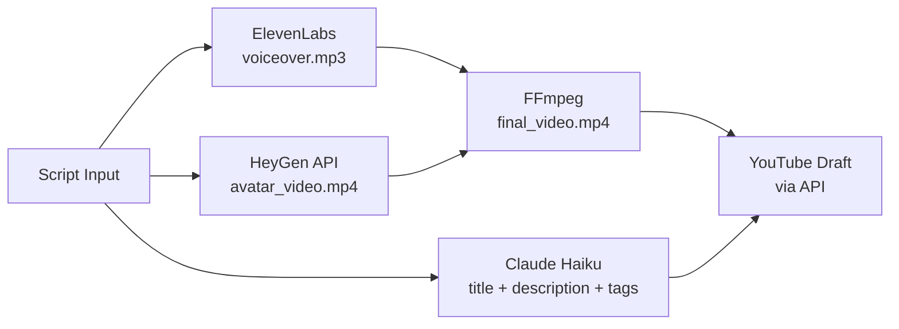

# Proposal: AI Video Workflow — Script to Finished YouTube Video

**Job:** AI Video Workflow Specialist. Script to Finished YouTube Video
**Client:** Barcelona, ESP. 4.9 rating, 28 reviews, 100% hire rate, $12K spent
**Date:** 2026-06-08
**Bid:** $750

---

## Hook

Built a working slice of your pipeline. Script in, ElevenLabs voiceover out, HeyGen avatar video submitted, FFmpeg assembles the 1080p cut, and Claude generates the title, description, and tags.

**Demo:** https://ai-video-pipeline-demo-crebgx7glbynk9dsxtsdue.streamlit.app
**Screenshots:** [ATTACHED]

---

## What the Demo Does

The Streamlit app takes a script, selects a voice, and runs the full pipeline:
1. ElevenLabs generates the voiceover MP3
2. HeyGen receives the script and avatar ID, returns a video ID (async, 2-3 min)
3. A poll step checks HeyGen status and downloads when ready
4. FFmpeg merges audio and video into a 1080p MP4
5. Claude Haiku generates the YouTube title, description, and tags in one call

The demo includes a fallback mode: if HeyGen is not configured, FFmpeg assembles the audio over a branded static thumbnail so the pipeline structure is demonstrable immediately.

---

## FFmpeg vs Remotion

FFmpeg wins for a single-channel pipeline at your volume. Remotion adds a Node.js runtime, a browser rendering layer, and per-render overhead that isn't justified for linear video assembly. The only case for Remotion is if you need dynamic data-driven templates (e.g., different lower-thirds per video from a spreadsheet). For your use case, FFmpeg handles assembly in under 30 seconds and the only recurring cost is API calls.

---

## Architecture

```
Trigger:     Manual run or n8n schedule (per script file / Google Sheet row)
Input:       Script text, voice ID, avatar ID
Processing:  ElevenLabs TTS → HeyGen avatar job → FFmpeg merge → Claude metadata
Output:      1080p MP4 + YouTube draft (title, description, tags)
Verify:      Video file size check, YouTube API draft confirmation
```



---

## Tech Stack and Timeline

**Stack:** ElevenLabs (TTS), HeyGen API (avatar), FFmpeg (assembly), Claude Haiku (metadata), n8n (orchestration), YouTube Data API v3 (upload)

**Timeline:**
- Day 1: Connect ElevenLabs + HeyGen, test voiceover and avatar output with your scripts
- Day 2: FFmpeg assembly pipeline, output quality review
- Day 3: Claude metadata generation, YouTube API draft upload
- Day 4: n8n orchestration, scheduling, error handling (HeyGen timeout, API rate limits)
- Day 5: End-to-end run on 3 real scripts, QA pass, handoff

**Total: 5 days from kickoff**

---

## Pricing

**Phase 1 (this project):** $750 fixed
- Full pipeline: ElevenLabs → HeyGen → FFmpeg → YouTube draft
- Claude metadata generation (title, description, tags)
- n8n orchestration with retry logic
- Tested on 3 of your real scripts before handoff

**Phase 2 options:**
- Thumbnail generation (DALL-E or Canva API, auto-placed text)
- Google Sheets trigger (one row = one video, batch processing)
- Multi-voice/persona pipeline (different avatar per channel)
- Monthly maintenance retainer: $400/month
