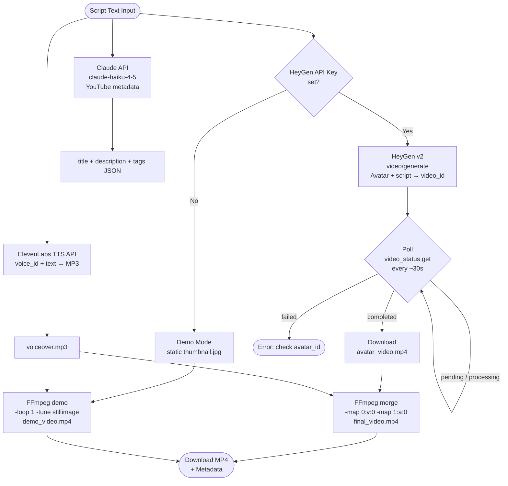

# AI Video Pipeline — Architecture

## Step-by-step

| Step | Service | Endpoint | Async? |
|------|---------|----------|--------|
| 1 | ElevenLabs | `POST /v1/text-to-speech/{voice_id}` | No (sync) |
| 2 | HeyGen | `POST /v2/video/generate` | Yes — poll |
| 2b | HeyGen | `GET /v1/video_status.get?video_id=` | Poll until `completed` |
| 3 | Claude (Haiku) | Anthropic Messages API | No (sync) |
| 4 | FFmpeg (local) | subprocess | No (sync) |

## HeyGen timing notes

- Typical processing time: **2-3 minutes** for a 60-90 second video
- Maximum wait recommended: 10 minutes
- If status stays `pending` after 10 min, re-submit or check HeyGen dashboard
- HeyGen does not push webhooks in the free tier — polling is required
